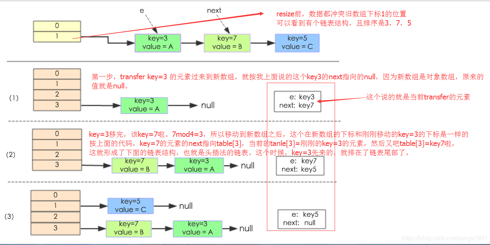
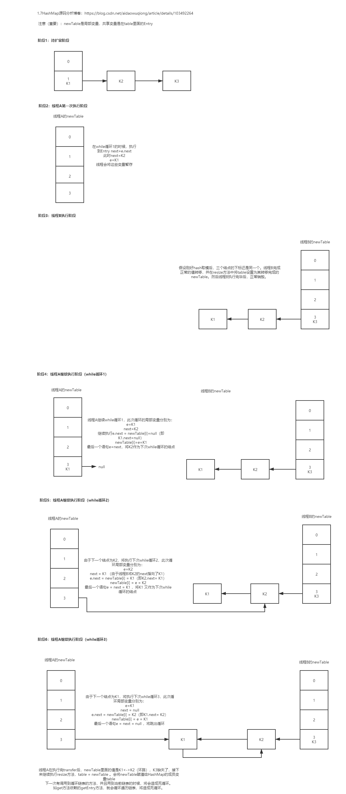
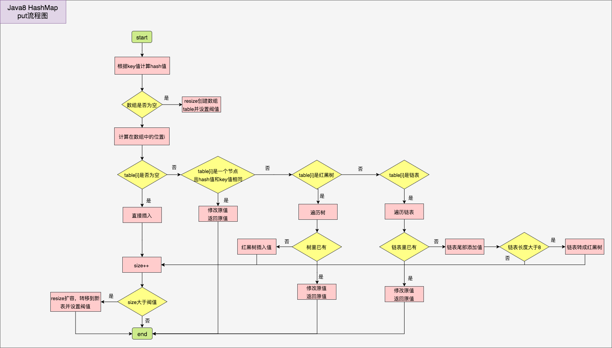
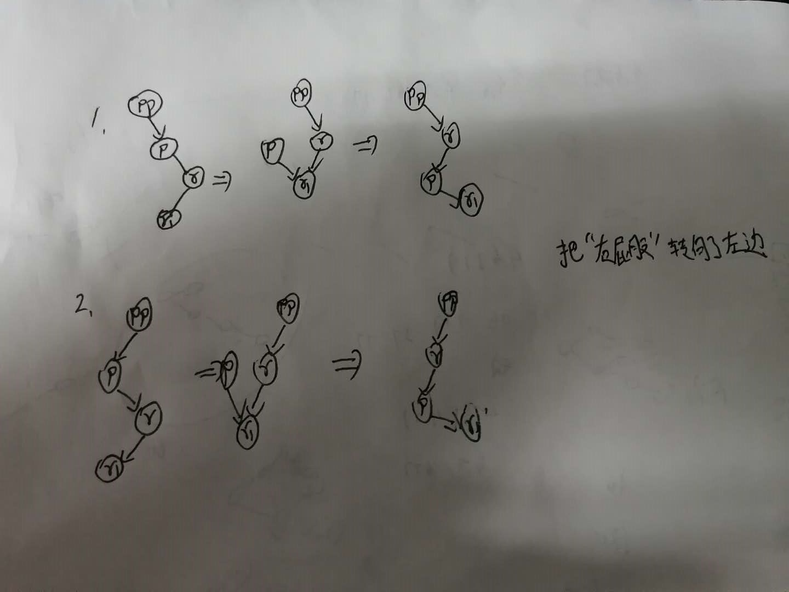
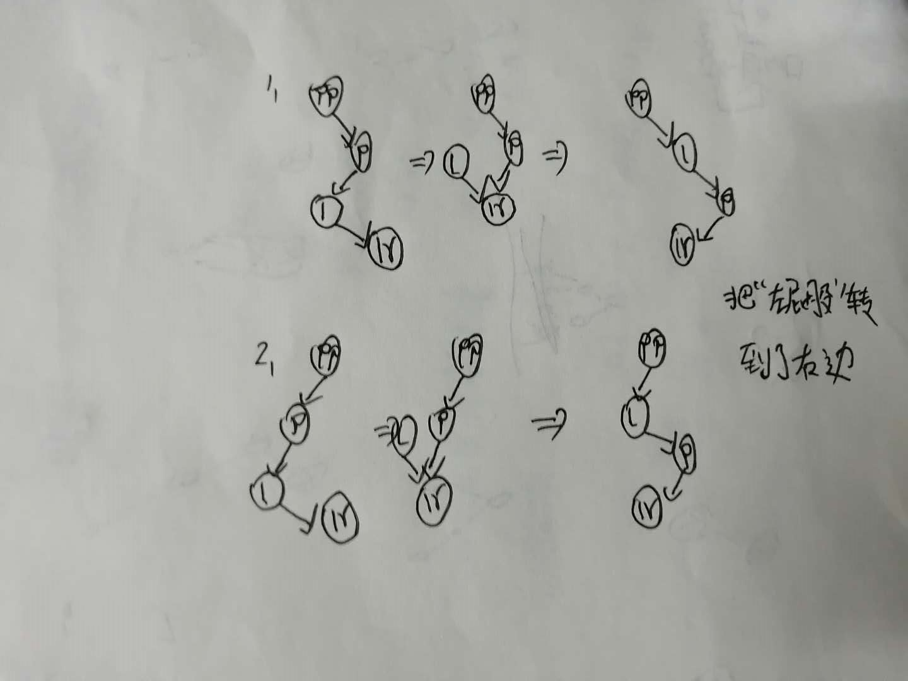

# HashMap

## 空间分配
1. HashMap为什么要将空间设置为2的幂次？
>答：这与HashMap的哈希算法有关，HashMap是通过
tab = [(n-1) & hash] 算出节点所在的数组下标的，
其中n为数组的长度，因此，如果n为2的幂次，则n-1
为全一，因此可以保证数组的每个位置都有被放置的
可能。反之，如果长度不是2的幂次，那么n-1又会有
1个或多个0位，这些位置为1的数组下标均不可以放置
节点，因此，有效位置减少，产生哈希冲突的概率会增加

2. HashMap扩容（resize()）
>jdk7中的扩容：
```
void resize(int newCapacity) {
        Entry[] oldTable = table;
        int oldCapacity = oldTable.length;
        if (oldCapacity == MAXIMUM_CAPACITY) {
            //如果旧容量已经是最大容量了，则将当前阈值设置为整型的最大值，并返回
            threshold = Integer.MAX_VALUE;
            return;
        }

        //创建新的entry数组
        Entry[] newTable = new Entry[newCapacity];
        //迁移元素到新的table（newTable）
        transfer(newTable, initHashSeedAsNeeded(newCapacity));
        table = newTable;
        threshold = (int) Math.min(newCapacity * loadFactor, MAXIMUM_CAPACITY + 1);
    }
    
void transfer(Entry[] newTable, boolean rehash) {
        int newCapacity = newTable.length;
        for (Entry<K, V> e : table) {//遍历原表中的全部节点
            while (null != e) {          //遍历某个节点链上的全部节点
                Entry<K, V> next = e.next;
                if (rehash) {//如果节点需要重新哈希，则重新哈希
                    e.hash = null == e.key ? 0 : hash(e.key);
                }
                //获取当前节点在新数组中的下标
                int i = indexFor(e.hash, newCapacity);
                //newTable[i]表示bucket[i]的第一个Entry
                //重新插入在数组该位置的节点（头插法），会导致之前在同位置的节点翻转
                e.next = newTable[i];
                newTable[i] = e;
                //这一步是配合while(null != e) 向后遍历原table的bucket。
                e = next;
            }
        }
    }
```

> jdk7扩容，在多线程情况下会导致死循环的问题

注：1.8中HashMap的扩容在链表的情况下，不是头插法，因此扩容后，链表节点的顺序不会改变，
因此在多线程环境下也不会成环。但是这并不意味着可以在多线程环境下使用1.8的HashMap，因为
其get/put方法都没有线程同步机制，无法保证在多线程环境下，上一秒put的值，下一秒get的时候
还是原来的值。在多线程情况下，可以使用ConcurrentHashMap。

>jdk8中的扩容：
```
final Node<K,V>[] resize() {
        Node<K,V>[] oldTab = table;
        int oldCap = (oldTab == null) ? 0 : oldTab.length;
        int oldThr = threshold;
        int newCap, newThr = 0;
        if (oldCap > 0) {
            if (oldCap >= MAXIMUM_CAPACITY) {
                //如果旧表的容量已经到最大值了，则将阈值置为整型的最大值，并直接返回旧表
                threshold = Integer.MAX_VALUE;
                return oldTab;
            }
            /**
             * 将新的容量扩展为之前的2倍，
             * 如果扩展之后的容量小于最大容量，
             * 并且旧表的容量比默认的最小初始容量（16）要大，
             * 则将新的阈值设置为旧阈值的2倍
             */
            else if ((newCap = oldCap << 1) < MAXIMUM_CAPACITY &&
                     oldCap >= DEFAULT_INITIAL_CAPACITY)
                newThr = oldThr << 1; // double threshold
        }
        //如果旧阈值大于0，并且旧的容为0，则直接将新的容量设置为旧的阈值
        else if (oldThr > 0) // initial capacity was placed in threshold
            newCap = oldThr;
        else {               // zero initial threshold signifies using defaults
            /**
             * 如果旧的阈值为0，
             * 则将新的容量初始化为默认初始化容量，
             * 并将新的阈值设置为默认负载因子和默认初始容量的乘积（向下取整）
             */
            newCap = DEFAULT_INITIAL_CAPACITY;
            newThr = (int)(DEFAULT_LOAD_FACTOR * DEFAULT_INITIAL_CAPACITY);
        }
        if (newThr == 0) {
            /**
             * 如果新的阈值没有被设置，
             * 如果新容量小于最大容量，并且新容量和负载因子的乘积小于最大容量
             * 则将新阈值设置为新容量和负载因子的乘积的向下取整，否则将新阈值
             * 设置为整型的最大值
             */
            float ft = (float)newCap * loadFactor;
            newThr = (newCap < MAXIMUM_CAPACITY && ft < (float)MAXIMUM_CAPACITY ?
                      (int)ft : Integer.MAX_VALUE);
        }
        //将当前阈值设置为新阈值
        threshold = newThr;
        @SuppressWarnings({"rawtypes","unchecked"})
        Node<K,V>[] newTab = (Node<K,V>[])new Node[newCap];
        table = newTab;//切换到新的表
        if (oldTab != null) {//如果旧表非空
            for (int j = 0; j < oldCap; ++j) {
                //遍历旧表
                Node<K,V> e;
                if ((e = oldTab[j]) != null) {
                    //从旧表中取出节点，如果节点非空
                    //将旧表对应的节点置空
                    oldTab[j] = null;
                    /**
                     * 如果当前节点的下一个节点为空，
                     * 则将当前节点直接进行“重哈希”（将 原来的哈希值 与 容量-1 进行与操作）
                     */
                    if (e.next == null)
                        newTab[e.hash & (newCap - 1)] = e;
                    /**
                     * 如果当前节点的下一个节点非空，并且当前节点是一个红黑树的节点
                     * 进行树形节点的拆分，将红黑树拆分成，在新数组中下标发生变化的节点，以及在新数组中下标不会发生变化的节点，
                     * 并将这些节点重新分配到新数组的指定位置，
                     * j是当前节点在旧数组中所在的位置，oldCap是旧数组的容量
                     */
                    else if (e instanceof TreeNode)
                        ((TreeNode<K,V>)e).split(this, newTab, j, oldCap);
                    else { // preserve order
                        /**
                         * 如果当前节点是普通节点（即链表）
                         * 遍历当前节点后面的全部节点（一个链表上的）
                         * 如果当前节点在新数组中的位置不变，则将当前节点连接到loHead上，
                         * 如果当前节点在新数组中的位置改变，则将当前节点连接到hiHead上
                         */
                        Node<K,V> loHead = null, loTail = null;
                        Node<K,V> hiHead = null, hiTail = null;
                        Node<K,V> next;
                        do {
                            next = e.next;
                            if ((e.hash & oldCap) == 0) {
                                if (loTail == null)
                                    loHead = e;
                                else
                                    loTail.next = e;
                                loTail = e;
                            }
                            else {
                                if (hiTail == null)
                                    hiHead = e;
                                else
                                    hiTail.next = e;
                                hiTail = e;
                            }
                        } while ((e = next) != null);
                        /**
                         * 如果在新数组中位置和之前一样的节点存在，则将这些节点的头节点放到新数组对应位置中，
                         * 同样，如果在新数组中位置发生改变的节点存在，则将这些节点的头节点放到新数组的对应位置中。
                         * 可将，jdk8在扩容时，不会发生链表的翻转
                         */
                        if (loTail != null) {
                            loTail.next = null;
                            newTab[j] = loHead;
                        }
                        if (hiTail != null) {
                            hiTail.next = null;
                            newTab[j + oldCap] = hiHead;
                        }
                    }
                }
            }
        }
        //返回新数组
        return newTab;
    }
```
## 基本方法
> jdk8中HashMap的put方法
```
public V put(K key, V value) {
        return putVal(hash(key), key, value, false, true);
    }

    /**
     * Implements Map.put and related methods.
     *
     * @param hash hash for key
     * @param key the key
     * @param value the value to put
     * @param onlyIfAbsent if true, don't change existing value
     * @param evict if false, the table is in creation mode.
     * @return previous value, or null if none
     */
    final V putVal(int hash, K key, V value, boolean onlyIfAbsent,
                   boolean evict) {
        /**
         * 将一个key-value对放到HashMap中
         */
        Node<K,V>[] tab; Node<K,V> p; int n, i;
        /**
         * 如果哈希数组为空或者哈希数组的长度为0，
         * 则需要对哈希数组进行扩容，
         * 并将扩容后的长度赋值给n
         */
        if ((tab = table) == null || (n = tab.length) == 0)
            n = (tab = resize()).length;
        /**
         * 根据当前元素的哈希值，获取当前元素在哈希数组中的索引位置，
         * 并将该位置对应的节点赋值给p，如果该位置为空则将新的节点放到该位置
         */
        if ((p = tab[i = (n - 1) & hash]) == null)
            tab[i] = newNode(hash, key, value, null);
        /**
         * 如果该位置的节点非空，
         */
        else {
            Node<K,V> e; K k;
            /**
             * 如果当前哈希数组索引位置的节点（p）的哈希值等于要插入节点的哈希值，
             * 并且p的key和要插入的key指向同一块儿内存，
             * 或者要插入节点的key与p的key值相等，则将e指向p
             */
            if (p.hash == hash &&
                ((k = p.key) == key || (key != null && key.equals(k))))
                e = p;
            /**
             * 如果p（哈希数组当前位置上的节点）是红黑树节点，
             * 则调用红黑树的插入方法，将key-value对插入
             */
            else if (p instanceof TreeNode)
                e = ((TreeNode<K,V>)p).putTreeVal(this, tab, hash, key, value);
            /**
             * 否则，如果当前节点是普通的链表节点，
             * 则从该节点向下遍历，并记录节点累计的个数，
             * 如果当前节点的后继为空，则说明已经遍历到哈希数组此位置的最后一个节点，
             * 则将当前节点的下一个节点指向基于要插入的key-value对创建的新节点，
             * 继续判断，如果当前节点的总数目已经≥8，则说明，此位置的链表应该树形化，
             * 因此调用树形化方法将节点树形化，然后跳出循环，
             *
             * 如果找到和要插入的节点哈希值和key都相同的节点，则退出循环，并将该节点返回
             */
            else {
                for (int binCount = 0; ; ++binCount) {
                    if ((e = p.next) == null) {
                        p.next = newNode(hash, key, value, null);
                        if (binCount >= TREEIFY_THRESHOLD - 1) // -1 for 1st
                            treeifyBin(tab, hash);
                        break;
                    }
                    if (e.hash == hash &&
                        ((k = e.key) == key || (key != null && key.equals(k))))
                        break;
                    p = e;
                }
            }
            if (e != null) { // existing mapping for key
                /**
                 * 如果成功将key对应的节点插入，或者找到了本来就有的key节点，
                 * 修改节点的值为新值，并返回旧值
                 */
                V oldValue = e.value;
                if (!onlyIfAbsent || oldValue == null)
                    e.value = value;
                afterNodeAccess(e);
                return oldValue;
            }
        }
        ++modCount;
        //如果插入节点后，HashMap的大小已经大于阈值了，则需要将其扩容
        if (++size > threshold)
            resize();
        afterNodeInsertion(evict);
        return null;
    }
```

## TreeNode


> 是HashMap中的红黑树节点

1. TreeNode的数据结构
```
static final class TreeNode<K,V> extends LinkedHashMap.Entry<K,V> {
        //红黑树节点
        TreeNode<K,V> parent;  // red-black tree links
        TreeNode<K,V> left;
        TreeNode<K,V> right;
        TreeNode<K,V> prev;    // needed to unlink next upon deletion
        boolean red;
        TreeNode(int hash, K key, V val, Node<K,V> next) {
            super(hash, key, val, next);
        }
}
```
2. TreeNode的成员方法

> root() 返回当前节点的根节点

```
final TreeNode<K,V> root() {
            for (TreeNode<K,V> r = this, p;;) {
                /父节点为空的节点，一定是根节点
                if ((p = r.parent) == null)
                    return r;
                r = p;
            }
}
```
> moveRootToFront() 保证红黑树的根节点也是链表的首节点
```
static <K,V> void moveRootToFront(Node<K,V>[] tab, TreeNode<K,V> root) {
            //总的来说就是将根节点移动到了最靠前的位置
            int n;
            if (root != null && tab != null && (n = tab.length) > 0) {
                /**
                 * 如果根节点非空，
                 * 并且表table非空，
                 * 并且表的长度大于0（同时将n赋值为表的长度）
                 */
                //索引为 表长度减一 与根节点的哈希值 进行与操作
                int index = (n - 1) & root.hash;
                //从表中取出上述索引对应的节点，这个节点是第一个节点
                TreeNode<K,V> first = (TreeNode<K,V>)tab[index];
                if (root != first) {
                    //如果根节点不是最靠前的节点
                    Node<K,V> rn;
                    //将最靠前的位置赋值为根节点
                    tab[index] = root;
                    //获取根节点的前驱节点
                    TreeNode<K,V> rp = root.prev;
                    /**
                     * 如果根节点的后继节点非空，
                     * 则将根节点的后继节点的前驱节点置为根节点的前驱节点
                     * 就相当于从链中，把根节点去了出来
                     */
                    if ((rn = root.next) != null)
                        ((TreeNode<K,V>)rn).prev = rp;
                    /**
                     * 如果根节点的前驱节点非空，
                     * 则将前驱节点的后继节点置为根节点的后继节点
                     */
                    if (rp != null)
                        rp.next = rn;
                    /**
                     * 如果原最靠前的节点非空，则将该节点的前驱节点置为根节点
                     */
                    if (first != null)
                        first.prev = root;
                    /**
                     * 根节点额后继节点置为，原最靠前的节点
                     * 根节点的前驱节点为空
                     */
                    root.next = first;
                    root.prev = null;
                }
                //检查节点的有效性
                assert checkInvariants(root);
            }
        }
```

> find() 查询节点
```
final TreeNode<K,V> find(int h, Object k, Class<?> kc) {
            /**
             * 查找某个节点的思路：
             * 红黑是也属于二叉搜索树，
             * 因此，先比较目标节点和当前节点的哈希值，
             * 如果目标节点的哈希值大于当前节点，则将指针指向当前节点的右子节点
             * 如果目标节点的哈希值小于当前节点，则将指针指向当前节点的左子节点
             * 如果目标节点的哈希值等于当前节点，那么会有2种可能
             * 1.当前节点的key就是目标节点的key（指向同一块儿内存），或者当前节点的key值和目标节点一直，那么溜直接返回当前节点
             * 2.与1相反，即发生了哈希冲突
             * 下面来说一下“2”这种情况：
             * 如果左节点为空（左节点走不了），就往右节点走，
             * 反之，如果右节点为空（右节点走不了），就往左节点走
             * 如果左右节点都不为空，则先判断，目标节点的key是不是可比较的
             * 如果是可比较的，则将目标节点的key与当前节点进行比较，
             * 同样，如果比当前节点大，则往右走，比当前节点小，则往左走。
             * 如果当前节点的key是不可比较的，则从右节点进行递归查找，
             * 如果右节点没找到，则再往左节点查找，直到找到，实在找不到就只能返回空了
             */
            TreeNode<K,V> p = this;
            do {
                int ph, dir; K pk;
                //pl为当前节点的左节点，pr为当前节点的右节点
                TreeNode<K,V> pl = p.left, pr = p.right, q;
                /**
                 * 将当前节点的哈希值赋给ph，
                 * 并判断，如果这个哈希值大于要查找的哈希值，
                 * 则将指针p指向当前节点的左节点
                 * （二叉搜索树，目标值比当前值小则将下一个搜索的节点指向当前节点的左节点），
                 */
                if ((ph = p.hash) > h)
                    p = pl;
                /**
                 * 如果当前节点的哈希值小于目标节点的哈希值
                 * 则将下一个搜索的节点指向当前节点的右节点
                 */
                else if (ph < h)
                    p = pr;
                /**
                 * 如果当前节点的哈希值恰好等于目标节点的哈希值
                 *
                 * 将当前节点的key值赋值给pk，
                 * 判断，如果pk和目标节点的key相同（指向同一块儿内存），
                 * 或者目标节点的key值非空，并且
                 * 当前节点的key值和目标节点的key值相等，
                 * 则说明找到了目标节点，直接将其返回
                 */
                else if ((pk = p.key) == k || (k != null && k.equals(pk)))
                    return p;
                /**
                 * 如果当前节点的哈希值和目标节点的哈希值相同，
                 * 但是当前节点的key和目标节点的key不是同一个，
                 * 并且值也不同
                 */

                /**
                 * 如果当前节点的左节点非空，就将p指向左节点，
                 * 如果当前节点的右节点非空，就将p指向右节点
                 */
                else if (pl == null)
                    p = pr;
                else if (pr == null)
                    p = pl;
                /**
                 * 如果kc非空，
                 * 或者 目标对象是个可比较的对象
                 * 则将目标对象和当前节点进行比较
                 * 比当前节点大则将p指向当前节点的右节点
                 * 比当前节点小则将p指向当前节点的左节点
                 */
                else if ((kc != null ||
                          (kc = comparableClassFor(k)) != null) &&
                         (dir = compareComparables(kc, k, pk)) != 0)
                    p = (dir < 0) ? pl : pr;
                /**
                 * 否则从右节点进行递归查找
                 */
                else if ((q = pr.find(h, k, kc)) != null)
                    return q;
                /**
                 *如果从右节点递归查找不到，则将指针指向当前节点的左节点
                 */
                else
                    p = pl;
            } while (p != null);
            return null;
        }
```

> treeify() 将与此节点链接的节点形成树形节点
```
final void treeify(Node<K,V>[] tab) {
            /**
             * 将与当前节点相连的全部节点，转换成红黑树
             */
            TreeNode<K,V> root = null;
            for (TreeNode<K,V> x = this, next; x != null; x = next) {
                //遍历与当前节点相连的全部节点
                next = (TreeNode<K,V>)x.next;
                //将当前节点的左指针和右指针置空
                x.left = x.right = null;
                if (root == null) {
                    /**
                     * 如果当前的根节点为空，
                     * 则将当前节点设置为根节点，
                     * 并将当前节点的父节点置空，
                     * 将当前节点设置为黑节点（红黑树的根节点是黑色的）
                     */
                    x.parent = null;
                    x.red = false;
                    root = x;
                }
                else {
                    //如果不是根节点
                    K k = x.key;
                    int h = x.hash;
                    Class<?> kc = null;
                    for (TreeNode<K,V> p = root;;) {
                        /**
                         * 从根节点开始遍历，找到当前节点的插入位置
                         * 如果当前节点的哈希值大于目标节点的哈希值，则将方向改为“向左”
                         * 如果当前节点的哈希值小于目标节点的哈希值，则将方向改为“向右”
                         * 否则，如果当前节点的哈希值和目标节点的哈希值相同，
                         * 则判断目标节点的key是不是可比较的，如果是不可比较的，或者是比较结果相等
                         * 则通过“tieBreakOrder”方法比较当前节点与目标节点，经过这个方法比较后，可以得到唯一的方向（向左或向右）
                         * 至此，我们可以判断出目标节点的下一个指向了，所以我们把该节点插入到指定的位置，
                         * 插入时可能会调整红黑树的结构
                         */
                        int dir, ph;
                        K pk = p.key;
                        if ((ph = p.hash) > h)
                            dir = -1;
                        else if (ph < h)
                            dir = 1;
                        else if ((kc == null &&
                                  (kc = comparableClassFor(k)) == null) ||
                                 (dir = compareComparables(kc, k, pk)) == 0)
                            dir = tieBreakOrder(k, pk);

                        TreeNode<K,V> xp = p;
                        if ((p = (dir <= 0) ? p.left : p.right) == null) {
                            x.parent = xp;
                            if (dir <= 0)
                                xp.left = x;
                            else
                                xp.right = x;
                            root = balanceInsertion(root, x);
                            break;
                        }
                    }
                }
            }
            /**
             * 然后将变为红黑树的节点的根节点移动到表的最前端
             */
            moveRootToFront(tab, root);
        }
```

> untreeify() 将与此节点链接的全部节点转换成一系列非树节点
```
final Node<K,V> untreeify(HashMap<K,V> map) {
            /**
             * 将当前节点的属性结构从树形节点转为链状节点
             */
            Node<K,V> hd = null, tl = null;
            for (Node<K,V> q = this; q != null; q = q.next) {
                /**
                 * 将当前节点换成普通的Node节点，
                 * 后面的就是将转换为的节点连接成链表就好了，
                 * 最后返回头结点
                 */
                Node<K,V> p = map.replacementNode(q, null);
                if (tl == null)
                    hd = p;
                else
                    tl.next = p;
                tl = p;
            }
            return hd;
        }
```

> putTreeVal() 插入树节点
```
final TreeNode<K,V> putTreeVal(HashMap<K,V> map, Node<K,V>[] tab,
                                       int h, K k, V v) {
            /**
             * 树形节点版本的put
             */
            Class<?> kc = null;
            boolean searched = false;
            //找到当前节点的根节点
            TreeNode<K,V> root = (parent != null) ? root() : this;
            for (TreeNode<K,V> p = root;;) {
                /**
                 * 从当前节点的根节点开始遍历
                 * 如果当前节点的哈希值大于目标节点，则将方向设置为“向左”，
                 * 如果当前节点的哈希值小于目标节点，则将方向设置为“向右”，
                 * 如果当前节点的哈希值与目标节点的哈希值相等，并且没有发生哈希冲突，则找到了该节点，返回它
                 * 否则，如果检测到哈希冲突，则判断当前节点的key是否可以进行比较，
                 * 如果不可以进行比较，或者比较的结果为相等，
                 * 如果当前节点没有被遍历过，
                 * 则递归的查找当前节点，并将当前节点标记为“已经遍历过了”
                 * 找到了则返回，没找到，则继续调整下一步的查找方向
                 */
                int dir, ph; K pk;
                if ((ph = p.hash) > h)
                    dir = -1;
                else if (ph < h)
                    dir = 1;
                else if ((pk = p.key) == k || (k != null && k.equals(pk)))
                    return p;
                else if ((kc == null &&
                          (kc = comparableClassFor(k)) == null) ||
                         (dir = compareComparables(kc, k, pk)) == 0) {
                    if (!searched) {
                        TreeNode<K,V> q, ch;
                        searched = true;
                        if (((ch = p.left) != null &&
                             (q = ch.find(h, k, kc)) != null) ||
                            ((ch = p.right) != null &&
                             (q = ch.find(h, k, kc)) != null))
                            return q;
                    }
                    dir = tieBreakOrder(k, pk);
                }

                /**
                 *如果下一个要找的方向，对应的节点为空，
                 * 则说明想要插入的值对应的key，之前并不存在于HashMap里面，
                 * 因此，我们把这个想要插入的值进行创建，并将其连接到树型结构上
                 * 先按照二叉搜索树的方式插入，再进行红黑树的结构调整，然后返回空
                 */

                TreeNode<K,V> xp = p;
                if ((p = (dir <= 0) ? p.left : p.right) == null) {
                    Node<K,V> xpn = xp.next;
                    //新创建一个TreeNode
                    TreeNode<K,V> x = map.newTreeNode(h, k, v, xpn);
                    if (dir <= 0)
                        xp.left = x;
                    else
                        xp.right = x;
                    xp.next = x;
                    x.parent = x.prev = xp;
                    if (xpn != null)
                        ((TreeNode<K,V>)xpn).prev = x;
                    moveRootToFront(tab, balanceInsertion(root, x));
                    return null;
                }
            }
        }
```
> removeTreeNode() 移除树节点
```

```

> split() 节点拆分
```
final void split(HashMap<K,V> map, Node<K,V>[] tab, int index, int bit) {
            /**
             * 节点拆分
             */
            TreeNode<K,V> b = this;
            // Relink into lo and hi lists, preserving order
            TreeNode<K,V> loHead = null, loTail = null;
            TreeNode<K,V> hiHead = null, hiTail = null;
            int lc = 0, hc = 0;
            for (TreeNode<K,V> e = b, next; e != null; e = next) {
                /**
                 * 遍历树节点，
                 * 获取当前节点的下一个节点，并将当前节点与下一个节点断连，
                 *
                 */
                next = (TreeNode<K,V>)e.next;
                e.next = null;
                /**
                 * 1.等于0时，则将该树链表头结点放到新数组中，位于之前旧数组中的索引位置，即位置和原来一致
                 * 2.等于1是，说明当前节点在新数组中的位置发生了变化，新的位置为原旧数组中的索引位置+旧数组的长度。
                 */
                if ((e.hash & bit) == 0) {
                    /**
                     * 整体思路就是，
                     * 将位置在新数组中下标不变的节点，
                     * 连成一个链表，并记录当前链表的长度，链表的头结点是loHead，尾节点是loTail
                     */
                    //将loTail指向当前节点的前驱节点，如果当前节点的前驱为空，则将loHead指向当前节点
                    if ((e.prev = loTail) == null)
                        loHead = e;
                    //如果当前节点的前驱非空，则将loTail的后继节点指向当前节点
                    else
                        loTail.next = e;
                    loTail = e;
                    ++lc;
                }
                else {
                    /**
                     * 和上面的类似，
                     * 只不过这个分支是为那些在新数组中下标发生了改变的节点，重新构建成一个链表，
                     * 该链表的头结点是hiHead，尾节点是hiTail，并记录当前节点的长度
                     */
                    if ((e.prev = hiTail) == null)
                        hiHead = e;
                    else
                        hiTail.next = e;
                    hiTail = e;
                    ++hc;
                }
            }

            if (loHead != null) {
                /**
                 * 如果存在那些，在新数组中下标没有发生变化的节点，即还在原来的位置
                 * 如果这些节点的总长度≤6，则将这些树形节点，转换为普通节点，
                 * 否则的话，则直接将这些节点的头结点放到新数组执行下标的位置，
                 * 并且，如果hiHead为空，则说明， 还有在新数组中下标发生变化的节点没有处理完，因此，当前节点还不能树化
                 * 如果非空， 则可以将当前节点进行树化
                 */
                if (lc <= UNTREEIFY_THRESHOLD)
                    tab[index] = loHead.untreeify(map);
                else {
                    tab[index] = loHead;
                    if (hiHead != null) // (else is already treeified)
                        loHead.treeify(tab);
                }
            }
            if (hiHead != null) {
                /**
                 * 如果存在那些在新数组中下标发生改变的节点，即新下标的位置为（原来位置 + 原来数组长度）
                 * 判断，如果这种节点的数目≤6，则将这些节点去树化，并将头结点放到新数组中对应的索引位置
                 * 反之，如果这种节点的数目比6大，则将头结点放到新数组中对应的索引位置，
                 * 并判断那些在新数组中位置没发生变化的节点是否存在，如果不存在，则说明这些节点都已经被处理过了
                 * 因此，可以直接将当前类型的节点树化
                 */
                if (hc <= UNTREEIFY_THRESHOLD)
                    tab[index + bit] = hiHead.untreeify(map);
                else {
                    tab[index + bit] = hiHead;
                    if (loHead != null)
                        hiHead.treeify(tab);
                }
            }
        }
```
> rotateLeft() , rotateRight() 树旋转
```
static <K,V> TreeNode<K,V> rotateLeft(TreeNode<K,V> root,
                                              TreeNode<K,V> p) {
            TreeNode<K,V> r, pp, rl;
            if (p != null && (r = p.right) != null) {
                /**
                 * 如果p节点的右子节点非空，则将r指向p节点的右子节点
                 *
                 * 1.如果r节点的左子节点非空，则将p的右指针指向r的左子节点，并将r1指针也指向r的左子节点；
                 *
                 * 2.将r的父节点指针指向p的父节点，并将指针pp也指向p的父节点，并继续判断，
                 * 如果这个p的父节点本身就是空，则直接将根指针至相关r，并将其设置为黑色节点（红黑树的根节点是黑色的）
                 * 
                 * 3.如果p节点的父节点非空，继续判断，如果pp的左子节点为p，则将该左指针指向r，
                 * 如果pp的右子节点为p，则将该右指针指向r
                 * 
                 * 4.最后，将r的左指针指向p，将p的父指针指向r
                 */
                if ((rl = p.right = r.left) != null)
                    rl.parent = p;
                if ((pp = r.parent = p.parent) == null)
                    (root = r).red = false;
                else if (pp.left == p)
                    pp.left = r;
                else
                    pp.right = r;
                r.left = p;
                p.parent = r;
            }
            return root;
        }
```
红黑树左旋转

红黑树右旋转（代码略）


> balanceInsertion() 树节点的平衡插入

> balanceDeletion() 树节点的平衡删除

> checkInvariants() 节点的合理性检查
```
static <K,V> boolean checkInvariants(TreeNode<K,V> t) {
            /**
             * 节点的合理性检查
             * 1.如果当前节点的前驱节点非空，但是前驱节点的后继节点不是当前节点，则异常
             * 2.如果当前节点的后继节点非空，但是后继节点的前驱不是当前节点，则异常
             * 3.如果当前节点的父节点非空，但是当前节点既不是父节点的左子节点，也不是父节点的右子节点，则异常
             * 4.如果当前节点的左子节点非空，但是左子节点的父节点不是当前节点，或者左子节点的哈希值反倒大于当前节点的哈希值，则异常
             * 5.如果当前节点的右子节点非空，但是右子节点的父节点不是当前节点，或者右子节点的哈希值反倒小于当前节点的哈希值，则异常
             * 6.如果当前节点为红色，但是当前节点的左子节点和右子节点也都是红色（红黑树规定红节点的两个子节点都必须是黑的），则异常
             * 7.递归检查当前节点的左子节点
             * 8.递归检查当前节点的右子节点
             * 9.如果没查出异常，则返回真
             */
            TreeNode<K,V> tp = t.parent, tl = t.left, tr = t.right,
                tb = t.prev, tn = (TreeNode<K,V>)t.next;
            if (tb != null && tb.next != t)
                return false;
            if (tn != null && tn.prev != t)
                return false;
            if (tp != null && t != tp.left && t != tp.right)
                return false;
            if (tl != null && (tl.parent != t || tl.hash > t.hash))
                return false;
            if (tr != null && (tr.parent != t || tr.hash < t.hash))
                return false;
            if (t.red && tl != null && tl.red && tr != null && tr.red)
                return false;
            if (tl != null && !checkInvariants(tl))
                return false;
            if (tr != null && !checkInvariants(tr))
                return false;
            return true;
        }
```